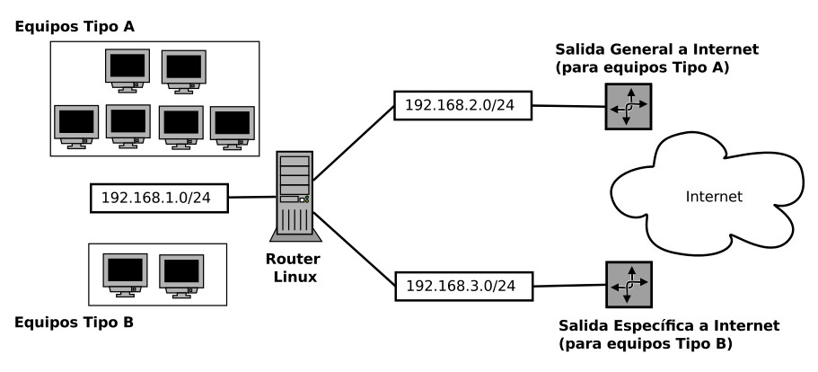

# Encaminamiento IP por origen

Terminado el curso y con todo el papeleo ya *finiquitado* tengo algo de tiempo
para documentar una configuración en la que trabajé hace unas semanas. La idea
es muy sencilla: \*en una red en la que se disponía de dos puertas de enlace
hacia Internet, encaminar la mayoría de los paquetes hacia una de ellas y solo
el tráfico originario de ciertos equipos hacia otra\*. Para cualquiera con un
poco de práctica en temas de red seguro que esto no deja de ser una tontería
pero para mi que no tengo muchas horas de vuelo en estos temas ha sido todo un
descubrimiento. 

Por supuesto que conozco la configuración básica para que una máquina Linux
comience a realizar labores de encaminamiento. Los criterios de la elección de
la ruta en este caso siempre son a partir del destino del paquete y por lo tanto
necesitaba algo más para este problema. Yo quería encaminar en base al origen
del tráfico, no según la red destino. Como se puede ver en el diagrama, tenía en
una red dos clases de equipos, los cuales quería redirigir a puertas de enlace
diferentes según la dirección IP de estos. En mi caso, estas salidas a Internet
estaban en subredes diferentes pero también podían haber estado en la misma
subred.

::: {.imagen}

:::

El descubrimiento para solucionar esto ha sido el comando [`ip`](http://linux.die.net/man/8/ip) que permite
manipular muchas más opciones de encaminamiento que el clásico [`route`](http://linux.die.net/man/8/route). La
idea ha sido aportar un encaminamiento por defecto para toda la red de la
izquierda y luego usando `ip` crear una tabla con reglas para filtrar según
los orígenes y a portar a dicha tabla un segundo encaminamiento hacia
Internet por la otra salida.

Primero realizamos los cambios típicos en cualquier Debian para permitir en
encaminamiento, descomentando la línea `net.ipv4.ip_forward=1` del fichero
`/etc/sysctl.conf`. Además ejecutamos:

    $ echo 1 > /proc/sys/net/ipv4/ip_forward

Debemos también [configurar perfectamente las interfaces de red](http://crysol.org/es/node/33) conectadas a la
máquina, en mi caso tres, en el fichero `/etc/network/interfaces`. Una vez
tengamos esto, aplicamos el encaminamiento por defecto para cualquier equipo de
la red de la izquierda en base a la red destino usando el comando
`route`. Configuramos también `iptables` para permitir dicho encaminamiento.

    $ route add default gateway 192.168.2.1
    $ iptables -F
    $ iptables -t nat -F
    $ iptables -t nat -X
    $ iptables -t nat -A POSTROUTING -j MASQUERADE

Ya tenemos nuestro router funcionado pero sacando todo el tráfico por la
salida de la parte superior de la imagen. Usando el comando `ip`, crearemos una
tabla de excepciones donde guardaremos las direcciones IP de los equipos
denominados **Tipo B**. Además configuraremos en esta tabla el encaminamiento
específico que deben tener los equipos cuyas direcciones IP de origen están
almacenadas en ella. En nuestro caso, irán redirigidas a la puerta de enlace de
la parte inferior del diagrama.

    $ echo 200 tipoB >> /etc/iproute2/rt_tables
    $ ip route add default via 192.168.3.1 dev eth0 table tipoB
    $ ip rule add from 192.168.1.155 table tipoB
    $ ip rule add from 192.168.1.248 table tipoB
    $ ip rule add from 192.168.1.109 table tipoB
    $ ip rule add from 192.168.1.87 table tipoB
    $ ip route flush cache

Seguramente existan métodos mejores para solucionar este problema porque como ya
he dicho soy bastante novato en temas de configuración de redes. Personalmente a
mi me ha servido para descubrir el comando `ip` y la cantidad de posibilidades
que ofrece este comando: crear más tablas de reglas, realizar balanceos de
carga, etc.

---

Julio 2013
