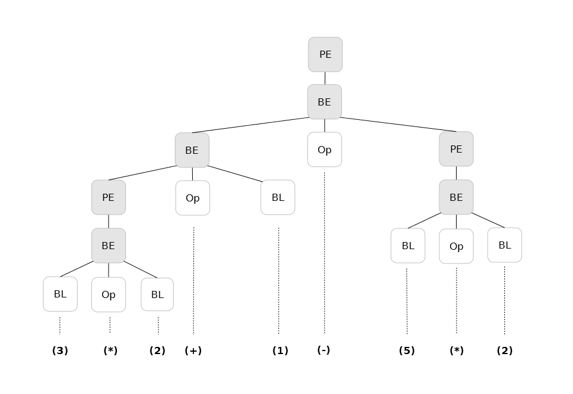

# Evaluando expresiones con un AST

A pesar de haber tenido una semana bien liada, he podido juntar algún rato este
fin de semana para seguir revisando la librería estándar de Go. Esta vez he
estado probando librerías bajo el paquete `go`, y en concreto, `go/parser` y
`go/ast`. Estos paquetes trabajan con el propio código de Go y son utilizados
por las herramientas ofrecidas por el entorno para formatear, analizar o generar
la documentación con `godoc`.

La idea para las pruebas fue simple: un evaluador de expresiones aritméticas
sencillas y un conversor para obtener la notación prefija. Usando la función
`ParseExpr(exp)` de `go/parser` obtenemos el AST de la expresión que hemos
introducido. Este paquete también ofrece funciones para parsear ficheros enteros
escritos en Go y obtener así el [análisis sintáctico completo en forma de AST](http://en.wikipedia.org/wiki/Abstract_syntax_tree). En
`go/ast` tenemos las estructuras de los elementos con los que se construye el
AST así como interfaces como `Visitor` para realizar un recorrido en profundidad
del árbol. Podemos utilizar todas estas funciones para ir mucho más allá de mis
pruebas y realizar un análisis de código más avanzado, refactorizaciones, etc.

Para que os hagáis una idea de la estructura devuelta por el parser, a
continuación os muestro el AST construido a partir de la expresión: `((3*2) + 1 - (5*2))`

::: {.imagen}

:::

En el árbol se pueden ver las siguientes estructuras:

-   **ParenExp** (PE): Estructura con paréntesis
-   **BinaryExp** (BE): Expresión binaria
-   **BasicLit** (BL): Literal

La [documentación de la librería estándar](http://golang.org/pkg/go/ast) detalla todo lo relacionado a estas y a
otras estructuras que podemos encontrar en un AST.

Para realizar la evaluación aritmética ha bastado una función recursiva que
recorra el AST. Esta función recibe como entrada un Nodo que representa la raíz
del árbol y retorna una estructura llamada `BasicLit` que contiene un literal
numérico junto con su tipo.

    func evalNode(n ast.Node)(*ast.BasicLit,error){
    
            var err error
            var lit1,lit2 *ast.BasicLit
    
            lit:=new(ast.BasicLit)
            switch nod := n.(type) {
            case *ast.BasicLit:
                    lit=nod
            case *ast.ParenExpr:
                    lit,err=evalNode(nod.X)
            case *ast.BinaryExpr:
                    lit1,err=evalNode(nod.X)
                    lit2,err=evalNode(nod.Y)
                    lit,err=operate(lit1,lit2,nod.Op)
            case *ast.UnaryExpr:
                    lit2,err=evalNode(nod.X)
                    lit1=new(ast.BasicLit)
                    lit1.Value="0"
                    lit1.Kind=lit2.Kind
                    lit,err=operate(lit1,lit2,nod.Op)
            }
    
            return lit,err          
    }

Siguiendo una lógica similar se ha realizado la función para generar la notación
prefija de la expresión dada. Recibimos un Nodo como entrada de la función y
vamos recorriendo en profundidad el árbol construyendo recursivamente un string
y retornándolo a la llamada anterior. 

    func prefixNotation(n ast.Node)(string){
            var r string
    
            switch nod := n.(type) {
            case *ast.BasicLit:
                    r=nod.Value
            case *ast.ParenExpr:
                    r=prefixNotation(nod.X)
            case *ast.BinaryExpr:
                    r=nod.Op.String()
                    r=r+" "+prefixNotation(nod.X)
                    r=r+" "+prefixNotation(nod.Y)
                    r="("+r+")"
            case *ast.UnaryExpr:
                    r=nod.Op.String()
                    r=r+" "+prefixNotation(nod.X)
                    r="("+r+")"
            }
    
            return r
    }

Como he comentado, trabajar de esta forma con código escrito en Go es realmente
sencillo y abre un abanico muy amplio de posibilidades. Podéis encontrar el
[código completo](https://gist.github.com/sdemingo/5696459) en mi cuenta de github.

---

Junio 2013
