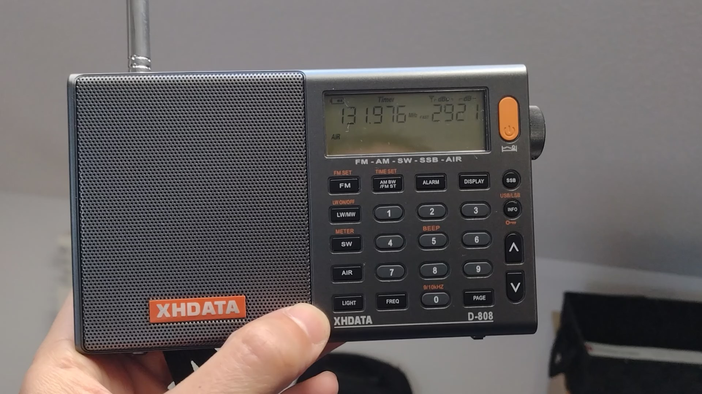

# Iniciándome en la radioescucha

Hace unas semanas me compré una pequeña radio multibanda. Una XHDATA 808, famosa en cualquier foro del mundillo. Tengo un par de conocidos bastante metidos en el mundillo de la radioafición y me han acabado convenciendo de que tener una pequeña radio de onda corta a mano puede darte un buen rato de divertimento en cualquier lugar del mundo. 

La onda corta, según he estado empapándome estos días, es un tipo de propagación que permite la comunicación a grandes distancias debido a su rebote en la ionosfera. Esto permite que con un pequeño receptor equipado de una simple antena telescópica de serie puedas captar emisiones de lugar lejanos. Yo en los primeros ratos de escucha he llegado a captar en mi casa emisiones incluso desde Tailandia (7475 khz). Evidentemente, la mayoría de estas emisiones pueden ser escuchadas desde internet sin mayores problemas pero creo que utilizar un receptor de este tipo nos aporta una experiencia «viejuna» que, a mi entender, es muy agradable. El ruido blanco de fondo y la estática me encantan. 

Otro aspecto que me hace especial ilusión es captar sin mayores problemas las emisiones de banda aérea. En este rango de emisiones situadas aproximadamente entre los 110 y los 137 Mhz del espectro se utilizan por los diferentes actores del tráfico aéreo (torres, controles de aproximación, aeródromos, pilotos, etc.) y viviendo cerca de aeródromos o aeropuertos puedes fácilmente escuchar sus transmisiones entre el amanecer y el atardecer. Yo durante estas semanas en las que he podido trastear con ella he conseguido pillar varias emisiones (gracias sobre todo a hilos encontrados en el foro de [escanerfrecuencias.es](http://www.escanerfrecuencias.es/FORO/)) de aeropuertos cercanos.

La radio incorpora una pequeña batería que tiene pinta de tener una duración mayor que un RTG y como es compacta y no muy grande, es ideal para llevármela de viaje. Aunque desde que la tengo solo he podido usarla unos cuantos ratos sueltos, todavía me queda mucho por hacer con ella: rastrear la banda de radioaficionados de mi zona, la banda ciudadana, encontrar radio balizas y radio faros, rastrear las famosas emisoras de números, etc. En definitiva, por apenas 60€ que me ha costado creo que ya es el mejor regalo que me hecho en 2024.

---

Febrero 2024
