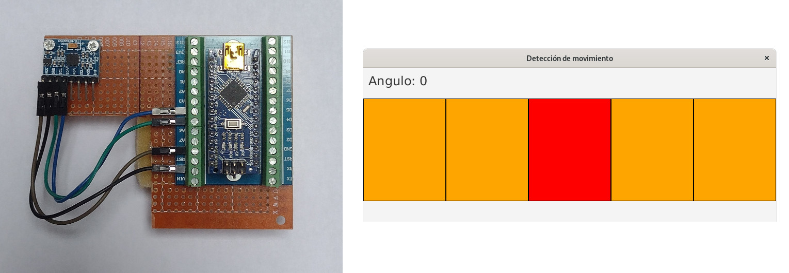

# Interfaces gráficas, Arduino y giroscopios

Desde hace un par de años imparto el módulo de Desarrollo de Interfaces Gráficas en el ciclo formativo de Desarrollo de Aplicaciones Multiplataforma. Este año al comienzo del curso me ha caído un nuevo tema que impartir en el módulo. No contaba con el y por eso no utilicé el verano para preparármelo, como hago otras veces. Así que he tenido que improvisar sobre la marcha. La nueva unidad didáctica trata sobre interfaces naturales (gestos, reconocimiento de voz, VR, etc.) y sus aplicaciones prácticas. Es un tema que me parece apasionante y con un montón de aplicaciones prácticas aunque también, nadie negará, que sin ser un conocedor del tema no es fácil reciclarte y empaparte de conocimientos para preparar contenidos, prácticas y exámenes. 

A pesar de estar un poco *pez* en el tema he tirado para adelante y además de preparar alguna práctica pequeña sobre transcripción y reconocimiento de voz usando Java y Sphinx, he rebuscado en el baúl de los recuerdos y he desempolvado un viejo Arduino Nano que tenía por casa para que me saque del lío. A la hora de hablar de gestos y movimientos se me ha ocurrido que podía ser interesante hablarles de una IMU clásica y barata como la MPU 6050 y mostrarles lo fácil que es conectarla a un Arduino y procesar sus lecturas. Como en el módulo, la librería que más usamos para trabajar con interfaces gráficas es JavaFX he desarrollado una pequeña aplicación que lea el valor de un ángulo del puerto serie y señale en pantalla la inclinación cambiando de color una serie de paneles alineados horizontalmente. En la imagen podéis ver, tanto el dipositivo que he montado con un Nano y la MPU a la izquierda y una captura de la sencilla app gráfica a la derecha.

Tenéis todo el código, tanto del arduino como de la aplicación gráfica, en [mi github](https://github.com/sdemingo/imu-gui). No es gran cosa y espero completar todo esto para el curso que viene, cuando disponga de algo más de tiempo para profundizar más en el tema. Meter algo más de voz, algo de VR también, ... Por ahora, con estas cosas he podido salvar el asunto y espero que en clase me luzca el trabajo.

---

Febrero
