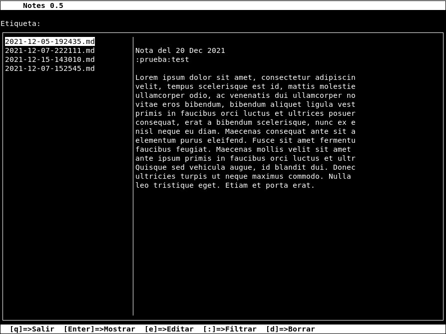

# Recordando ncurses

Ahora que va terminando el año y empiezo a tener algo más de tiempo me he puesto a tirar de la lista de cosas pendientes que he ido dejando por el camino.

Una de ellas era hacerme una pequeña aplicación para terminal que me permitiera gestionar cómodamente las notas y apuntes que voy tomando durante el día. Desde hace un año y medio más o menos vengo usando un sistema de pequeñas notas que voy almacenando en un directorio todas juntas ordenadas por fecha. Antes las hacia llegar hasta allí a traves del correo electrónico pero desde hace unos meses utilizo un bot de Telegram.

El caso es que, ese sistema que a mi se me parece a amontonar post-its digitales me obliga a una vez por semana pararme a organizarlas: fusionar las semejantes o que tienen que ver, borrar las que no merece la pena guardar, etc. Este fin de semana lo he utilizado en programar una sencilla aplicación en C usando la librería ncurses. Hacia casi quince años que no tocaba ncurses y la verdad, es que ha sido durillo. Nunca llegué a crear nada complejo con esta librería y lo poco que la utilicé lo tenía muy olvidado ya. De cualquier forma, como mi objetivo no era hacer nada complicado en un par de horas tuve el primer prototipo más o menos funcionando. Luego en otro par de ratos durante el domingo lo pude ajustar algo más hasta conseguir algo funcional.

Si queréis ojear la aplicación o el código, lo tenéis todo en mi [github](https://github.com/sdemingo/notes)

---

Diciembre 2021
