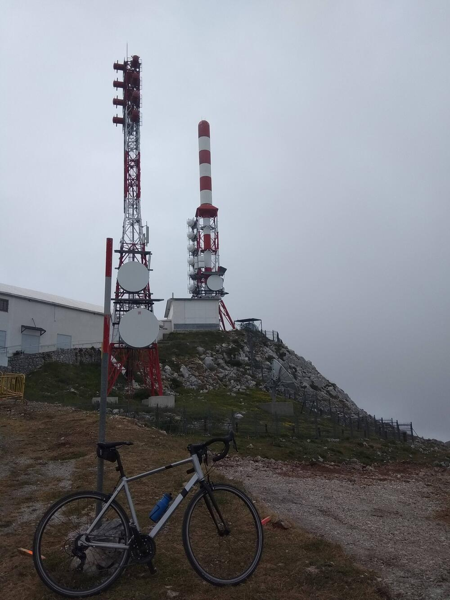
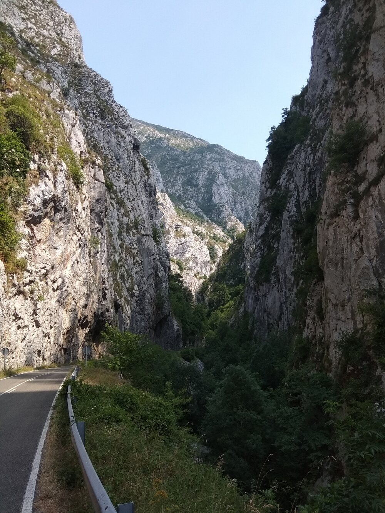
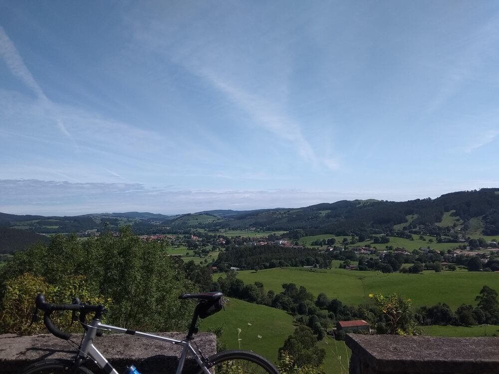

# Resumen ciclista del 2021

El 2021 ha sido un gran año para mi en todo lo relacionado con la bici. He
acumulado <u>**5700 kilómetros**</u>, la cual considero una muy buena
marca. Solo otro año anteriormente conseguí superar los 5000 kilómetros. Así que
estoy contento. Ha sido un año sin lesiones ni caídas además, con lo que puedo
darme por muy satisfecho en todo lo logrado. Además de los circuitos y rutas
locales que, como nos pasa a todos, tenemos más que quemadas, he disfrutado de
muy buenas salidas.

Este año, durante la Semana Santa, que siempre suelo viajar fuera, no hemos
salido así que todas las rutas de descubrimiento han sido durante el
verano. Este verano me he movido sobre todo por Asturias y Cantabria. En
Asturias, paraíso ciclista por excelencia, tenía la **cima del Gamoniteiro**
marcada de antemano. Esta cima se alcanza subiendo al clásico puerto de La
Cobertoria por cualquier de sus dos vertientes (Lena o Bárzana) y justo arriba
tomar una pista asfaltada que nos conduce a la antena de
comunicaciones. Mientras que La Cobertoria me pareció  un puerto precioso y
duro, el último tramo hasta la antena fue de una dureza excesiva. Sumado la
niebla que según me contaron es muy frecuente en esas cimas, la sensación total
del Gamoniteiro fue un poco decepcionante. 

Otro puerto que descubrí en las cercanías fue **Ventana**. Otro *puertarraco*
tremendo donde sumé más de 15 kilómetros de ascensión y que comunica con la
provincia de León. Las vistas desde la cima, la carretera, los desfiladeros,
... un auténtico disfrute para el ciclismo. De Asturias me marché subiendo
además **El Mirador del Fito** y con la espina clavada de subir a los lagos. He
ido cuatro veces a Cangas y no he conseguido hilar tiempo para hacer la que es,
sin duda, la ascensión más mítica de los puertos asturianos.

Ya en Cantabria tuve tiempo para conocer carreteras que tenía olvidadas por la
comarca de Meruelo y el valle de Aras, subiendo **Fuente de Varas**. Un día
espléndido, un cielo azul y un solo que calentaba sin atosigar completaron el
que fue el mejor día de ciclismo del verano. Terminé mis vacaciones conociendo
la comarca de Las Merindades y subiendo puertos míticos de aquella zona como
**Picón Blanco**, **La Sía** o **Portillo de Lunada**. Lástima que el día no
acompañara y sufriera un día húmedo, frío y con niebla. Me han comentado que
subir La Lunada un día soleado es una experiencia inolvidable.

En definitiva y como comentaba al principio ha sido un gran año. Esperemos que
el 2022 me trate tan bien como este año en términos ciclistas. Nos vemos en las
carreteras.

---

Enero 2022
