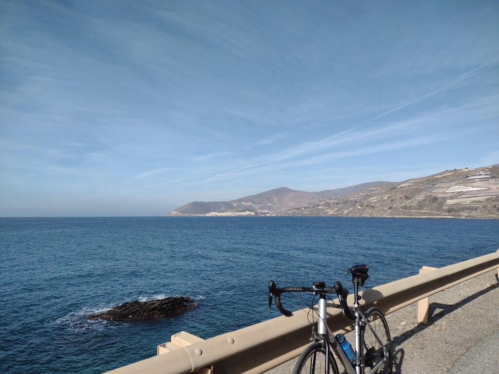
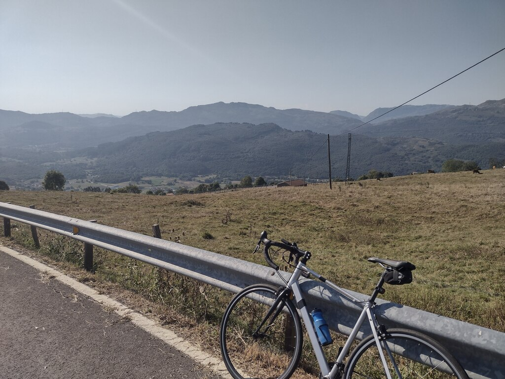

# Resumen ciclista del 2022

Termina el año y al llegar diciembre dejo la bicicleta algo apartada. Frío y
días cortos son el conjunto perfecto para bajarme durante dos o tres
semanas. Así, al llegar enero suelo tener ganas y motivación suficiente para
empezar el año otra vez sobre los pedales. 

Por tanto como hago otros años, es momento de hacer balance de lo
recorrido. Cuando miro a [los números del año
pasado](./resumen-ciclista-2021.md.html) no puedo evitar estar algo
desanimado. Este año con los **4600** kilómetros acumulados me he quedado
bastante lejos de la anterior marca. Han sido un cúmulo de circunstancias las que
han hecho que haya montado mucho meno. La peor de todas, sin duda, ha sido la
espalda. Los dolores de espalda me han perseguido durante estos últimos doce
meses. He sufrido varias lumbalgias en diferentes momentos de este año que me
han dejado tirado en la cuneta durante semanas. Nunca antes me había pasado y me
ha costado entender que quizás hayan venido para atormentarme periódicamente a
partir de ahora.

Durante la Semana Santa este año buscamos el calor del sur de la península y nos
fuimos a la costa de Granada. Allí descubrí la gran **ruta de la N-340**. Una
pequeña carretera secundaria que transita a borde de mar y acantilados desde
cerca de Motril hasta llegar a tierras almerienses. Al estar la A-7 cubriendo
esta ruta el tráfico por esta carretera es muy reducido y apenas la utilizan
grupos de moteros disfrutando del paisaje, las curvas y los desniveles. Una
carretera ideal para la práctica del ciclismo.

Tras unos días por la zona nos movimos al Cabo de Gata. Allí los carreteros
estamos algo más limitados si queremos trazar rutas cerca de la costa. Toda la
zona del cabo está recorrida por una pista de grava solo apta para bicicletas de
montaña o gravel. Aún así, hice varios recorridos por la parte interior
disfrutando de paisajes y carreteras muy tranquilas.

Llegó el verano y hubo drástico cambio de planes. La idea inicial del viaje al
Valle de Aosta en la frontera franco-italiana fue desechado por el alto precio
del gasoil. El plan B era volver a Asturias y disfrutar de su región
occidental. Todo se fue al traste debido a los problemas mecánicos de la
furgoneta y tuvimos que improvisar. Volvimos a Cantabria, a carreteras y rutas
conocidas: el Cabo de Ajo, el Valle de Aras, Ramales de la Victoria, Laredo,
etc.

Allí me volvieron los dolores de espalda y tuve que dejar marcado para otro año
otra cima mítica que me ilusionaba subir en la zona de Santander como es Peña
Cabarga. Igual que me pasó con Lagos de Covadonga el año anterior, habrá que
dejar el proyecto para el futuro.

Tras el verano poco más aparte de las rutas locales con las que acumular
kilómetros con la grupeta. La sensación es que me he dejado muchas rutas
pendientes en el tintero: Peña Cabarga, Lagos de Covadonga (otra vez), Mijares
en el Tietar, ... No ha sido mi mejor año pero vendrán otros mejores. 

---

Diciembre 2022
