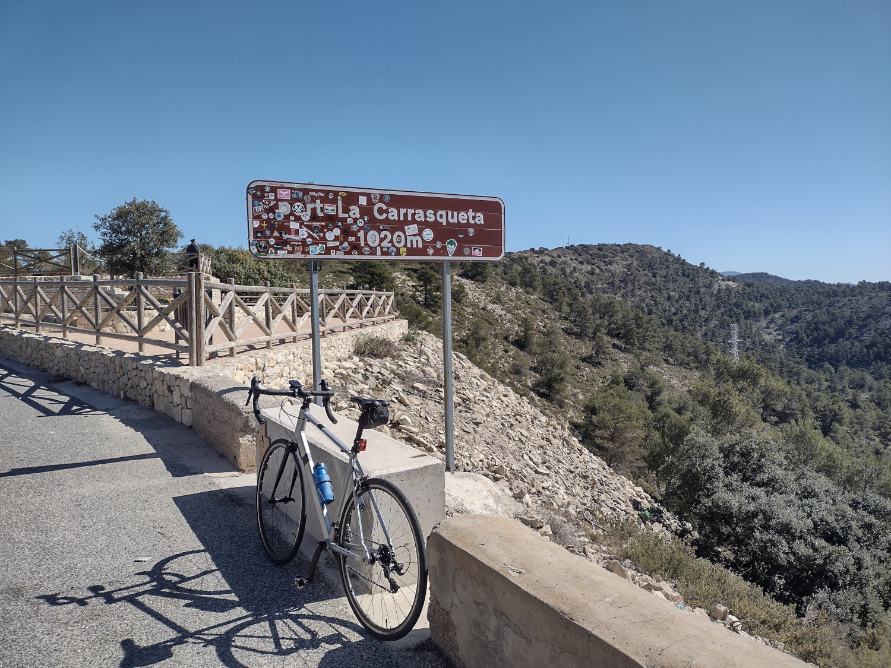

# Resumen ciclista del 2023

Un año más me gusta dedicar una entradita del blog a mis *aventuras biclísticas*. Utilizo estas fechas para desengacharme un poco de la rutina semanal de pedalo y salidas en bici y creo que por ello es buen momento para hacer balance. 

Lo primero los números, que en mi opinión son positivos. Sobre todo porque son casi iguales a los del [año pasado](http://panicerror.org/blog/resumen-ciclista-2022.md.html). Si bien este pasado no fue mi mejor año, tampoco se me dio mal del todo. Así que si he conseguido mantenerme en cifras parecidas creo que no me puedo quejar. En total han sido casi 4700 kilómetros en 95 entrenos. No he llegado a los dos entrenos de media anual pero me he quedado cerca. Las salidas han sido mas largas de promedio que el año pasado porque he salido más con la bici de carretera. Todo esto con cero dolores de espalda. Después de 12 meses sin dolores creo que puedo dar el tema de espondilolistesis y las lumbalgias por controlado. Solo por eso ya sería un grandísimo año.

A nivel de rutas no ha sido tan variado como otros años pero tampoco ha estado mal. Durante la Semana Santa me llevé la bicicleta a Alicante y allí pude subir **La Carrasqueta** uno de los días que salí con más tiempo. En concreto subí por Xixona desde El Campello. Lo ideal es hacerla con más tiempo y poder unir la ruta con Ibi, Alcoy u otra población para hacer algo circular. Yo me tuve que conformar con un subir y bajar.

En el puente de mayo dejé la bici en casa así que de ahí me voy mi verano cantabro tradicional. Da igual que lleve años montando por allí que siempre conozco rutas nuevas. Esta vez le tocó a un clásico que todavía no había subido: el **Puerto de Alisas**. Un puertazo con sabor clásico de los que gustan: largo y tendido. Si a eso lo sumas que lo subí una tarde de agosto, con 20º y una lluvia finísima que me iba refrescando el radiador ... pues ya no se puede pedir más. Montar en bicicleta en Cantabria es un regalo. 

Poco más que pueda destacar al margen de las salidas clásicas por mi zona después del verano. Para al año que viene tengo grandes planes de esos que no quiero dejar por escrito por si se gafan. Si todo va bien y no hay problemas puedo anunciar que será otro gran año donde podré contaros que he hecho algún kilómetro más y he subido bonitos puertos que todavía no conozco.

Esperemos seguir así.

---

Diciembre 2023

