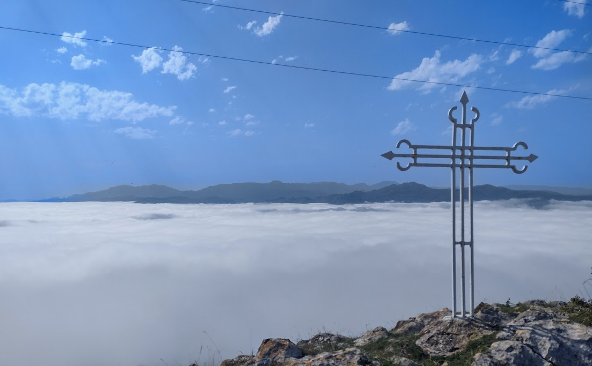

# Resumen ciclista del 2024

Aquí vuelvo un año más con el balance de todos los ratos que he pasado en los pedales durante este año. Si algo ha marcado el año ha sido la grave caída que tuve en primavera. En un lugar que conocía con la palma de mi mano y en una bajada que habré hecho miles y miles de veces en los últimos veinte años me pegué el tortazo más bestia que me he dado nunca. El resultado, que pudo ser mucho peor, se saldó con una rotura muscular que me tuvo en el dique seco mes y medio. No es mucho tiempo, pero perdí las seis o siete semanas donde suelo acumular más kilómetros en el año, desde primeros de mayo hasta mitad de junio. 

Así pues el año se cierra con apenas 3500 kilómetros en 82 salidas. No está mal pero claramente tengo que proponerme mejorar los números para el año que viene. La mejor noticia es que he dejado atrás el tema de los dolores de espalda y tengo la espondilolistesis totalmente bajo control. Como ya comenté por aquí en otro artículo, [vender mi autocaravana](https://panicerror.org/blog/adios-autocaravana.md.html) también ha tenido como consecuencia dejar de hacer salidas por sitios nuevos. Así que apenas tengo rutas nuevas de las que hablar al margen de las que he hecho en Cantabria durante el verano. Este año, además de conocer pequeños puertos escondidos entre montes cántabros como la **Cruz de Usaño**, he subido la mítica **Peña Cabarga**. Una brutal ascensión que comienza en las proximidades de Solares. Desde arriba, un día soleado tienes una vista privilegiada de la Bahía de Santander. El día que subí yo, un precioso mar de nubes se extendía por toda la región así que, aún sin poder ver Santander las vistas fueron igualmente espectaculares.

Tras el verano poco más que contar, aparte de las típicas salidas clásicas muy trilladas con la *grupeta*: Cruz Verde, Morata de Tajuña, etc. Esperemos tener un 2025 sin incidentes y donde pueda, no solo mejorar los números rácanos de este año, sino conocer algún que otro puerto nuevo.

---

Diciembre 2024

